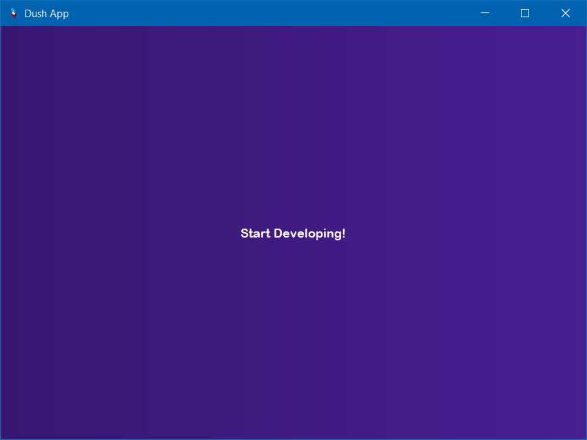
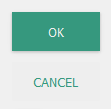
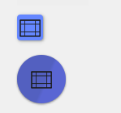

# Dush Widgets  
The best pyqt5 custom widget module. Built entirely in `python 3.10`
It provides you with suitable styled and easy to use widgets to implement in any of your applications.
It can be found in the pypi website <https://pypi.org> and other suitable websites.
Below is the steps to download Dush and run a simple demo program.
###Get Started
Installing Dush using pip
```bash
    pip install Dush==2.0.0
```
---
Installing from GitHub
```bash
    git clone htps:/github.com/DONT_TRY_THIS
```
#### Using Dush With PyQt5
```python
from PyQt5.QtWidgets import *
from PyQt5.Qt import *
import sys
from Dush.widgets import *
```

###Example
#### Demo.py
```python
from PyQt5.QtWidgets import *
from PyQt5.Qt import *
import sys
from Dush.ui import *

app = QApplication(sys.argv) # Initializes the Application
widget = QWidget() # Creating a Window on Screen

# Creating the label on the screen
label = Text(widget, 
               text='Start Developing!', 
               color='black', 
               bg='white',
               height=50, width=100)
label.display() # Displaying the label on screen

widget.show() # Displaying the window in the application
sys.exit(app.exec_()) # exit if the close button is pressed and loop the application
```
#### Result


## Using QtApp


we recommend to use `python 3.10` or earlier versions of python to run this application.
### PyQt5 Ui Coding made simple!
The main purpose for developing this appiication is to prevent the assle of developing custom widgets in pyqt5 with harder prerequisites
with a harder codebase we instead provide you with a simplistic and easy to use system for building
and using custom widgets provided by Dush. which made widget programming fun when using PyQt5.

# Ui Widgets
#### Buttons
```python
from Dush.ui.btn import *

flat_button = TextFlatButton(parent, 'OK')
flat_button.display(50, 50)

raised_button = RaisedButton(parent, 'OK')
raised_button.display(50, 100)

```


```python
from Dush.ui.btn import *

rectangular_button = RectangularButton(window,
                            icon_file=r'<YOUR IMAGE>.png')
rectangular_button.display(50, 150)

circular_button = CircularButton(window,
                            icon_file=r'<YOUR IMAGE>.png')
circular_button.display(50, 200)

```



### Requirements
* Windows 10+ (Used in development)
* MacOs 
* Linux Unbuntu
* `Python 3.10` or higher